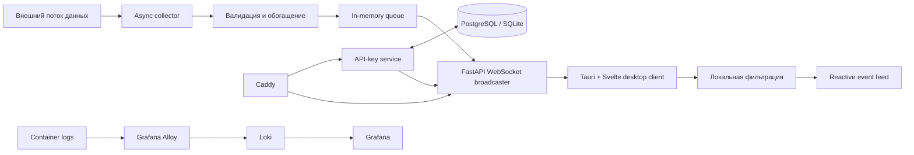

## О проекте

Ascend превращает высокочастотный поток данных из внешнего источника в компактную рабочую ленту. Backend получает события, обогащает их дополнительными метриками и безопасно транслирует авторизованным клиентам. Desktop-клиент валидирует сообщения, применяет пользовательские правила и обновляет интерфейс без перезагрузки страницы.

Проект охватывает полный путь данных — от интеграции с внешним API до desktop-интерфейса и production-инфраструктуры. Основной акцент сделан на асинхронной обработке, надежности соединения, контроле доступа и удобстве работы с большим числом событий.

## Возможности

- потоковая доставка данных через WebSocket с heartbeat и автоматическим переподключением;
- обогащение входящих событий связанными метриками и историей источника;
- фильтрация по диапазонам, агрегированным показателям и пользовательскому blacklist;
- локальное хранение настроек, импорт и экспорт конфигурации с версионированием схемы;
- авторизация по API-ключам со сроком действия, отзывом и лимитом одновременных сессий;
- безопасное открытие внешних ссылок через native API Tauri;
- адаптивный desktop-интерфейс с поддержкой клавиатурной навигации и reduced motion;
- централизованные логи, reverse proxy с TLS и резервное копирование PostgreSQL в S3-совместимое хранилище.

## Архитектура



Backend построен как набор независимых слоев: адаптер внешнего API, подготовка данных, прикладные сервисы, WebSocket-транспорт и отдельный модуль управления доступом. На клиенте сетевой слой, состояние, бизнес-правила и UI-компоненты также разделены, поэтому каждый уровень можно тестировать изолированно.

## Технологический стек

| Слой | Технологии |
| --- | --- |
| Desktop / frontend | Svelte 5, SvelteKit, TypeScript, Tailwind CSS 4, Tauri 2 |
| Backend | Python 3.11, FastAPI, Pydantic, asyncio, WebSocket |
| Data | PostgreSQL 16, SQLite для локальной разработки, SQLAlchemy 2, Alembic |
| Infrastructure | Docker Compose, Caddy, Grafana, Loki, Alloy, Restic |
| Quality | Vitest, Testing Library, ESLint, Prettier, svelte-check, pytest |

## Инженерные решения

### Real-time pipeline

Входящие сообщения проходят типизацию и валидацию на границе системы. Асинхронный collector обогащает событие, очередь развязывает получение и отправку данных, а broadcaster доставляет единый контракт всем активным клиентам. Доступ к реестру соединений синхронизирован через `asyncio.Lock`.

### Контроль доступа

Открытые секреты API-ключей не сохраняются: в базе находится SHA-256 hash с серверным pepper. Для ключей поддерживаются срок действия, отзыв, фоновая очистка и ограничение числа активных WebSocket-сессий. Watchdog повторно проверяет ключ во время соединения и закрывает сессию, если доступ больше не действителен.

### Устойчивый клиент

Клиент не доверяет входящему потоку: неизвестные типы и некорректные payload отбрасываются до попадания в состояние приложения. WebSocket-store управляет reconnect lifecycle, хранит ограниченное скользящее окно событий и применяет immutable snapshot настроек, чтобы одно событие всегда обрабатывалось согласованным набором правил.

### Эксплуатация

Docker Compose поднимает приложение вместе с PostgreSQL, миграциями, reverse proxy и observability-стеком. Для базы предусмотрены блокировка параллельных backup-задач, повторные попытки загрузки и retention policy: 7 дневных, 4 недельных и 6 месячных копий.

## Быстрый старт

### Требования

- Python 3.11+;
- Node.js и npm;
- Rust toolchain и системные зависимости Tauri — для desktop-сборки;
- учетные данные внешнего data provider;
- Docker — опционально, для запуска инфраструктурного стека.

### 1. Backend

Из корня репозитория:

```powershell
cd src/server
python -m venv .venv
.\.venv\Scripts\Activate.ps1
python -m pip install -r requirements.txt
Copy-Item .env.example .env
Copy-Item axiom_users_fingerprints.example.json axiom_users_fingerprints.json
```

Заполните `.env` и `axiom_users_fingerprints.json` собственными значениями интеграции. Не используйте демонстрационные секреты из `.env.example` вне локальной среды.

```powershell
alembic upgrade head
uvicorn app.main:app --reload
```

После запуска доступны:

- healthcheck — `http://localhost:8000/health`;
- OpenAPI — `http://localhost:8000/docs`;
- WebSocket — `ws://localhost:8000/ws`.

### 2. Ключ доступа для клиента

Создайте ключ административным endpoint. Значение `X-Admin-Secret` должно совпадать с `ADMIN_SECRET` в `.env`.

```bash
curl -X POST http://localhost:8000/api/v1/api-keys/create-api-key \
  -H "Content-Type: application/json" \
  -H "X-Admin-Secret: change-me" \
  -d '{"expires_in_days":7,"max_active_sessions":3,"label":"local-dev"}'
```

Скопируйте `api_key` из ответа: он понадобится на экране авторизации клиента.

### 3. Client

```powershell
cd ../client
Copy-Item .env.example .env
npm ci
npm run tauri dev
```

Для запуска только web-интерфейса используйте `npm run dev`.

## Запуск в Docker

Production-like окружение описано в `src/server/docker-compose.yml`. Перед запуском настройте домен, TLS email, PostgreSQL, Grafana, S3-совместимое хранилище (`POSTGRES_DB_BUCKET`) и секреты в `src/server/.env`, затем выполните:

```powershell
cd src/server
docker compose up --build -d
```

Миграции применяются отдельным one-shot контейнером до старта API. Backup-профиль можно запускать независимо:

```powershell
docker compose --profile backup_for_cron run --rm backup
```

## Проверка качества

Frontend:

```powershell
cd src/client
npm test
npm run check
npm run lint
```

Тесты покрывают обработку WebSocket lifecycle, фильтрацию, совместимость импортируемых настроек, безопасное построение ссылок и поведение UI-компонентов. В текущей версии — 59 frontend-тестов в 16 test suites.

Backend:

```powershell
cd src/server
python -m pip install pytest pytest-asyncio
python -m pytest app/api_keys/tests -q
```

Backend-тесты проверяют доменную модель ключей, repository layer и HTTP endpoints на временной SQLite-базе.

## Структура репозитория

```text
ascend_trenches/
├── src/
│   ├── client/                  # SvelteKit UI и Tauri shell
│   │   ├── src/lib/components/  # UI-компоненты
│   │   ├── src/lib/stores/      # Авторизация, настройки, WebSocket state
│   │   ├── src/lib/utils/       # Pure-функции и клиентские правила
│   │   └── src-tauri/           # Native desktop layer
│   └── server/                  # FastAPI application и инфраструктура
│       ├── app/api_keys/        # Домен, сервисы, repository и endpoints
│       ├── app/services/        # Сбор и трансляция данных
│       ├── third_party_apis/    # Адаптер внешнего provider API
│       ├── migrations/          # Alembic migrations
│       └── docker-compose.yml   # Runtime и observability stack
└── README.md
```

## Что можно развивать дальше

- вынести очередь сообщений в Redis Streams или Kafka для горизонтального масштабирования;
- добавить Prometheus-метрики и distributed tracing;
- автоматизировать проверки и сборку desktop-релизов в CI;
- расширить набор источников данных через общий интерфейс collector-а;
- добавить end-to-end тесты полного пути от события до отображения в UI.
