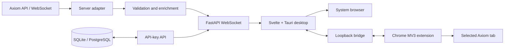
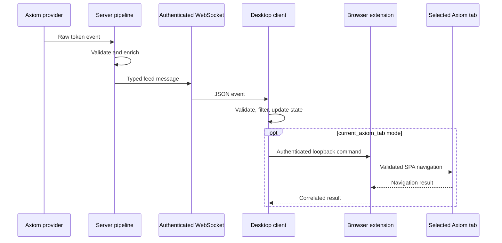

# Архитектура

## Контекст системы

Ascend связывает внешний поток Axiom, серверный pipeline, desktop-клиент и
опциональное браузерное расширение. Сервер является доверенной границей для
получения данных и проверки доступа. Пользовательские фильтры и настройки
остаются на устройстве пользователя.



## Компоненты

### Server

- `app/api_keys` содержит доменную модель ключа, прикладной manager, контракты
  repository и HTTP-адаптеры.
- `app/services/token_feed` собирает и подготавливает события.
- `app/services/ws_streaming` управляет соединениями и широковещательной
  отправкой token feed, heartbeat и цены SOL.
- `app/api` содержит транспортные FastAPI/WebSocket endpoints.
- `third_party_apis` изолирует модели, авторизацию и вызовы Axiom.
- `migrations` хранит версионируемую схему Alembic.

Точка сборки зависимостей — FastAPI lifespan и dependency providers. Доменная и
прикладная логика не должна импортировать FastAPI, SQLAlchemy или конкретный
клиент внешнего API. Она зависит от собственных моделей и абстракций; реализации
repository и provider подключаются на внешней границе.

### Desktop client

- `src/lib/components` отвечает за представление и пользовательские события.
- `src/lib/stores` управляет состоянием и жизненным циклом UI.
- `src/lib/utils` содержит чистые преобразования, валидацию и правила фильтрации.
- `src/lib/services` инкапсулирует побочные эффекты и интеграции.
- `src-tauri` является native-адаптером: открывает ссылки, подготавливает
  расширение и держит защищенный loopback bridge.

UI-компоненты не должны напрямую знать детали HTTP, WebSocket, browser storage
или Tauri commands. Эти детали располагаются в API/services/stores и передают в
UI типизированные данные.

Фильтр доли токенов разработчика использует включительные границы от `0%` до
`100%`. Нулевая нижняя граница является допустимой и выбрана по умолчанию, чтобы
события с `dev_holds_percent = 0` не отбрасывались до явного ужесточения фильтра
пользователем. Остальные основные фильтры (blacklist, recent-token fees и доля
миграций) применяются независимо; performance override может заменить только
проверку доли миграций.

Blacklist отклоняет входящее событие до добавления карточки в ленту, если любое
сохраненное значение встречается как подстрока в кошельке разработчика, названии
или тикере токена либо никнейме администратора. Сопоставление не зависит от
регистра и различий в апострофах (`dont`, `don't`, `don’t`).

Настройки desktop-клиента разделены на секции и сохраняются единым локальным
envelope V5. Секция `notifications` содержит флаг включения, громкость, источник,
идентификатор и безопасное отображаемое имя пользовательского файла. Экспорт
переносит только эти метаданные и не содержит бинарные данные; импорт V1–V4
создает настройки уведомлений по умолчанию.

`audioNotifications` инкапсулирует browser Audio API, проверку файла, preview,
сохранение и воспроизведение. Пользовательский Blob хранится отдельным
IndexedDB-адаптером, который атомарно заменяет единственную запись. Если запись
недоступна на текущем устройстве, сервис воспроизводит стандартный WAV, а
настройки явно показывают fallback. Сервис использует один канал: новый принятый
кол останавливает предыдущее уведомление и запускает звук с начала. WebSocket
store вызывает уведомление только после успешной фильтрации и добавления
карточки в видимую ленту; этот side effect не зависит от `AutoOpenDispatcher`.

Изображения текущего и предыдущих токенов используют один клиентский resolver.
Сначала он пробует URL из token feed, затем для валидного Solana-адреса —
предсказуемый URL Axiom CDN, а последним кандидатом — доверенный endpoint сервера
Ascend `/api/v1/token-images/{address}`. Endpoint валидирует Solana-адрес и
проксирует только фиксированный Axiom CDN с ограничением размера и типа ответа,
поэтому не является произвольным HTTP proxy. При ошибке загрузки компонент
немедленно переходит к следующему кандидату. Для свежего токена последний
кандидат повторяется с ограниченной задержкой; предыдущие токены не создают
повторный сетевой трафик.
Изображение не скрывается в ожидании события `load`, поэтому уже загруженный
WebView ресурс остается видимым даже при пропущенном событии. После подтвержденной
ошибки между попытками остается видимым текстовый fallback с тикером.

Header desktop-клиента сохраняет одну строку при ширине более 360 px. На ширине
250–360 px показатели и действия образуют две отдельные строки, поэтому группа
действий не распадается случайным переносом. При ширине 250–359 px лента,
карточки и диалоги переходят к узкой компоновке без глобального масштабирования:
поля и составные элементы занимают одну колонку, длинные значения сокращаются,
а действия остаются внутри viewport.

### Browser extension

- `lib/protocol` задает проверяемые сообщения между слоями.
- `lib/navigation` валидирует URL и управляет переходом внутри Axiom SPA.
- `lib/bridge` реализует связь с desktop-приложением.
- `lib/state` хранит состояние выбранной вкладки.
- `entrypoints` связывает эти части с WebExtension API и является composition
  root расширения.

Доступ расширения ограничен origin `https://axiom.trade/*`; переходы проверяются
до обращения к browser API и повторно на границах контекста страницы.

## Основной поток данных



## Направление зависимостей

Зависимости направлены от внешних механизмов к устойчивым правилам:

```text
frameworks / UI / database / external APIs
                  ↓
          adapters and services
                  ↓
       application and domain rules
```

Домен не знает о конкретной базе, web framework, SDK или внешнем провайдере.
Новая интеграция получает отдельный adapter и реализует локальный контракт.
Пересечение границы сопровождается валидацией и преобразованием внешней модели
во внутреннюю.

## Эксплуатационная топология

Production-like окружение описано в `src/server/docker-compose.yml`: Caddy
принимает HTTP/TLS-трафик, FastAPI работает за reverse proxy, PostgreSQL хранит
ключи, Alloy отправляет container logs в Loki, Grafana читает Loki. Restic backup
запускается отдельным Compose profile и выгружает дамп PostgreSQL в
S3-совместимое хранилище.

Детали находятся в [документе развертывания](deployment.md).
