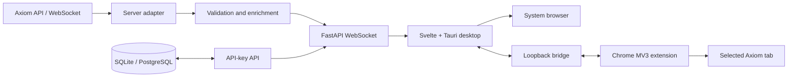
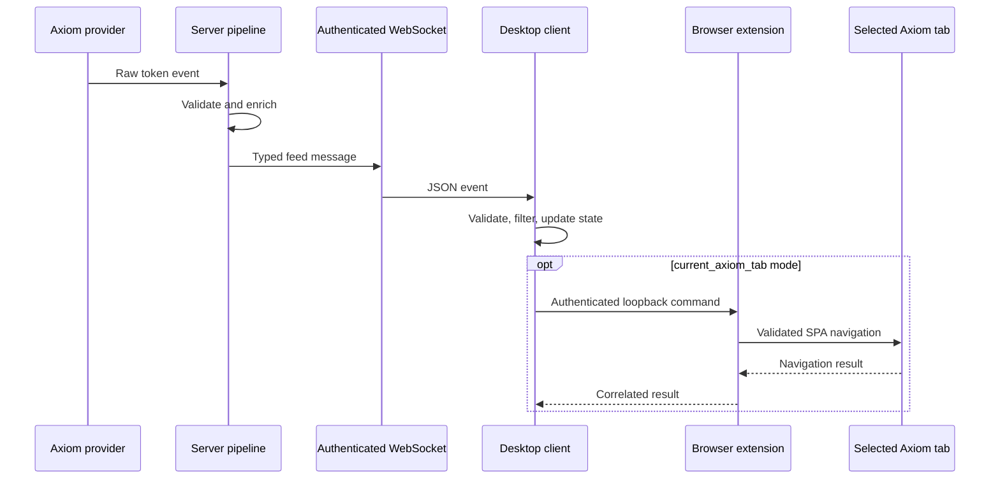

# Архитектура

## Контекст системы

Ascend связывает внешний поток Axiom, серверный pipeline, desktop-клиент и
опциональное браузерное расширение. Сервер является доверенной границей для
получения данных и проверки доступа. Пользовательские фильтры и настройки
остаются на устройстве пользователя.


```mermaid
flowchart LR
    Axiom[Axiom API / WebSocket] --> Adapter[Server adapter]
    Adapter --> Pipeline[Validation and enrichment]
    Pipeline --> Feed[FastAPI WebSocket]
    Keys[API-key API] --> Feed
    DB[(SQLite / PostgreSQL)] <--> Keys
    Feed --> Desktop[Svelte + Tauri desktop]
    Desktop --> Browser[System browser]
    Desktop <--> Bridge[Loopback bridge]
    Bridge <--> Extension[Chrome MV3 extension]
    Extension --> Tab[Selected Axiom tab]
```

## Компоненты

### Server

- `app/api_keys` содержит доменную модель ключа, прикладной manager, контракты
  repository и HTTP-адаптеры.
- `app/token_feed` собирает и подготавливает собственные события; SDK DTO
  преобразуются в adapter. Кэши, очередь и задачи принадлежат экземпляру.
- `app/streaming` управляет соединениями и широковещательной
  отправкой token feed, heartbeat и цены SOL.
- `app/streaming/router.py` содержит `/ws`; соединения используют собственный
  интерфейс и FastAPI adapter. Access adapter вызывает публичный api_keys.
- `app/token_prices` преобразует SDK events в собственный SolPrice и передаёт
  его callback. Доставка клиентам принадлежит streaming.
- `app/token_images` содержит provider contract и adapter фиксированного CDN.
- `third_party_apis` содержит независимый Axiom SDK, который не импортирует
  backend и получает credentials от вызывающей стороны.
- `migrations` хранит версионируемую схему Alembic.

Backend использует uv: `pyproject.toml` объявляет зависимости и группу `dev`,
`uv.lock` фиксирует полный граф, `.python-version` выбирает Python 3.14.
Разработка и Docker устанавливают зависимости с `--locked`; Docker исключает
группу `dev`. Решение описано в [ADR 0004](adr/0004-backend-uv.md).

`app/composition.py` собирает Runtime; `main.py` подключает маршруты и управляет
его lifespan. Импорт entrypoint не читает fingerprints и не создаёт SDK-клиент.
При остановке снимаются callbacks, отменяются и ожидаются задачи, закрывается
клиент. Неудачный startup освобождает созданные ресурсы.
Генератор lifespan имеет тип `AsyncGenerator[None, None]`; эта аннотация
подходит для `asynccontextmanager` и совместима с Python 3.14.
`database.py` регистрирует единственную ORM-модель через register_models;
Alembic использует ту же регистрацию. Схема и применённые миграции сохранены.
HTTP dependency providers собирают сервис ключей на транзакции запроса.
Доменная и
прикладная логика не должна импортировать FastAPI, SQLAlchemy или конкретный
клиент внешнего API. Она зависит от собственных моделей и абстракций; реализации
  repository и provider подключаются на внешней границе.

Для Solana-события token feed запрашивает `pair-info` текущей пары и извлекает
непосредственный funding wallet. История разработчика и история этого адреса
передаются разными полями WebSocket payload. Для обоих адресов используется
`dev-tokens-v5`; fees прошлых монет берутся из `token-info`. Ошибка или отсутствие
funding wallet не удаляет доступную историю разработчика. Выбор funding history
исключает текущий токен, дубликаты, слишком новые монеты и монеты без проверенных
fees. Developer history сохраняет отдельное правило: первые три записи,
с пропуском текущей пары только в начале; при недоступных fees сохраняются
null fees и ATH.

Сервер отправляет базовое событие непосредственно из WebSocket Axiom, не ожидая
HTTP-историй. Истории разработчика и funding wallet запрашиваются параллельно и
отправляются отдельными обновлениями той же пары. Клиент объединяет обновления
независимо от порядка доставки и применяет фильтры при каждом обновлении;
принятый токен отправляется на открытие только один раз. После обрыва соединения
клиент не запрашивает пропущенные события повторно. Все HTTP-вызовы клиента
Axiom проходят через общий ограничитель частоты (интервал 100 мс между стартами)
и параллелизма (default 50, проверено по коду 2026-09-27).
Запросы для новых событий имеют приоритет перед
обогащением историй; после 10 подряд новых запросов ограничитель дает ход одной
ожидающей истории, чтобы она не задерживалась бесконечно.
Ограничитель хранит две FIFO-очереди `deque`: новые события и историю.
Выбор следующего запроса не сканирует общую очередь; отменённые запросы
удаляются при достижении начала своей очереди и не расходуют ход.
При отключённом DEBUG размер очереди для каждого стартующего запроса
не вычисляется. Выбор HTTP-агента сначала группирует агентов по прокси
и считает нагрузку, затем выбирает наименее занятый маршрут и агента.
При равной нагрузке выбор циклический; паузы после `429` и сетевых ошибок
учитываются совместно для всего маршрута.
Одновременные запросы
истории одного funding wallet
объединяются; история кошелька, данные прошлых пар и fees повторно используются
из краткоживущего кэша в течение 3 секунд. Запись кэша содержит именованные
поля `expires_at` и `task`. При заполнении удаляется завершённая задача;
активные общие запросы сохраняются. Отмена одного ожидающего не отменяет
общую задачу. Обогащение списка запускает обработку отдельных токенов
параллельно; данные пары и fees также запрашиваются параллельно.
Недоступные или некорректные fees приводятся к отсутствующему значению,
после чего применяются отдельные правила developer и funding history.
Неуспешный ответ не кэшируется. При `429`
маршрут охлаждается на `Retry-After`, а повторы ограничены числом попыток и
ожиданием не более 120 секунд. Ошибка funding-истории не удаляет базовый колл.
Логи содержат накопленные запросы по endpoint, долю `429`, размер и возраст
очереди запросов и попадания в кэш.

Границы модулей и собственные типы описаны в
[ADR 0003](adr/0003-backend-modules.md), совместимость и известные дефекты — в
[отчёте рефакторинга](backend-refactoring.md).

### Desktop client

- `src/lib/components` отвечает за представление и пользовательские события.
- `src/lib/stores` управляет состоянием и жизненным циклом UI.
- `src/lib/utils` содержит чистые преобразования, валидацию и правила фильтрации.
- `src/lib/services` инкапсулирует побочные эффекты и интеграции.
- `src-tauri` является native-адаптером: открывает ссылки, подготавливает
  расширение и держит защищенный loopback bridge.

UI-компоненты не должны напрямую знать детали HTTP, WebSocket, browser storage
или Tauri commands. Эти детали располагаются в API/services/stores и передают в
UI типизированные данные.

Фильтр доли токенов разработчика использует включительные границы от `0%` до
`100%`. Нулевая нижняя граница является допустимой и выбрана по умолчанию, чтобы
события с `dev_holds_percent = 0` не отбрасывались до явного ужесточения фильтра
пользователем. После blacklist и dev holds клиент оценивает три стратегии
независимо: `Dev Migrations` требует recent-token fees и долю миграций,
`Last Tokens` — число прошлых монет с нужным ATH, а `Dev Funding` — историю
funding wallet с собственными порогами доли миграций и fees.
Чистое правило `Dev Funding` находится в `src/client/src/lib/utils/devFunding.ts`:
оно проверяет сеть, наличие адреса, долю миграций всех токенов funding wallet
по счетчикам Axiom и хотя бы одну предыдущую монету с проверенными fees по
локальным настройкам. `feed.ts` объединяет результаты трех
правил после общих фильтров; сервер передает данные и не применяет настройки
пользователя.

`Dev Funding` использует отдельную историю funding wallet и может принять
Solana-карточку независимо от fees и доли миграций разработчика. Карточка
показывает индикатор `Dev Funding` и отдельный раздел прошлых монет этого
кошелька; пустая или неподтвержденная funding-история и отсутствующие счетчики
миграций не дают срабатывания. Стратегия включена по умолчанию с режимом `avg`,
порогом `0 SOL` и минимальной долей миграций `10%`; ее настройки
сохраняются локально и переносятся при экспорте. Старые файлы настроек получают
эти значения по умолчанию без изменения остальных фильтров.
Карточка отдельно показывает долю миграций funding wallet, когда доступны его
счетчики; строка разработчика продолжает показывать его собственную статистику.
Клиент связывает обновления по адресу пары (или токена) и сохраняет одну
карточку. Счетчики, звук и автооткрытие выполняются один раз при первом
принятии токена; позднее обогащение меняет индикаторы и истории в этой карточке.
Повторный базовый payload не стирает уже полученную funding-историю.
Если fees монеты разработчика недоступны, она может участвовать в `Last Tokens`
по проверенному ATH, но не дает срабатывания fees-фильтра `Dev Migrations`.

Blacklist отклоняет входящее событие до добавления карточки в ленту, если любое
сохраненное значение встречается как подстрока в кошельке разработчика, названии
или тикере токена либо никнейме администратора. Сопоставление не зависит от
регистра и различий в апострофах (`dont`, `don't`, `don’t`).

Настройки desktop-клиента разделены на секции и сохраняются единым локальным
envelope V5. Секция `notifications` содержит флаг включения, громкость, источник,
идентификатор и безопасное отображаемое имя пользовательского файла. Экспорт
переносит только эти метаданные и не содержит бинарные данные; импорт V1–V4
создает настройки уведомлений по умолчанию.

`audioNotifications` инкапсулирует browser Audio API, проверку файла, preview,
сохранение и воспроизведение. Пользовательский Blob хранится отдельным
IndexedDB-адаптером, который атомарно заменяет единственную запись. Если запись
недоступна на текущем устройстве, сервис воспроизводит стандартный WAV, а
настройки явно показывают fallback. Сервис использует один канал: новый принятый
кол останавливает предыдущее уведомление и запускает звук с начала. WebSocket
store вызывает уведомление только после успешной фильтрации и добавления
карточки в видимую ленту; этот side effect не зависит от `AutoOpenDispatcher`.

Изображения текущего и предыдущих токенов используют один клиентский resolver.
Сначала он пробует URL из token feed, затем для валидного Solana-адреса —
предсказуемый URL Axiom CDN, а последним кандидатом — доверенный endpoint сервера
Ascend `/api/v1/token-images/{address}`. Endpoint валидирует Solana-адрес и
проксирует только фиксированный Axiom CDN с ограничением размера и типа ответа,
поэтому не является произвольным HTTP proxy. При ошибке загрузки компонент
немедленно переходит к следующему кандидату. Если все источники недоступны,
текущий и предыдущие токены повторяют проверку всех источников. Задержка
постепенно растет до пяти минут, чтобы изображение появилось после временного
сбоя сети или поздней публикации в CDN без частых запросов.
Изображение не скрывается в ожидании события `load`, поэтому уже загруженный
WebView ресурс остается видимым даже при пропущенном событии. После подтвержденной
ошибки между попытками остается видимым текстовый fallback с тикером.

Header desktop-клиента сохраняет одну строку при ширине более 360 px. На ширине
250–360 px показатели и действия образуют две отдельные строки, поэтому группа
действий не распадается случайным переносом. При ширине 250–359 px лента,
карточки и диалоги переходят к узкой компоновке без глобального масштабирования:
поля и составные элементы занимают одну колонку, длинные значения сокращаются,
а действия остаются внутри viewport.

### Browser extension

- `lib/protocol` задает проверяемые сообщения между слоями.
- `lib/navigation` валидирует URL и управляет переходом внутри Axiom SPA.
- `lib/bridge` реализует связь с desktop-приложением.
- `lib/state` хранит состояние выбранной вкладки.
- `entrypoints` связывает эти части с WebExtension API и является composition
  root расширения.

Доступ расширения ограничен origin `https://axiom.trade/*`; переходы проверяются
до обращения к browser API и повторно на границах контекста страницы.

## Основной поток данных


```mermaid
sequenceDiagram
    participant P as Axiom provider
    participant S as Server pipeline
    participant W as Authenticated WebSocket
    participant C as Desktop client
    participant E as Browser extension
    participant T as Selected Axiom tab

    P->>S: Raw token event
    S->>S: Validate and enrich
    S->>W: Typed feed message
    W->>C: JSON event
    C->>C: Validate, filter, update state
    opt current_axiom_tab mode
        C->>E: Authenticated loopback command
        E->>T: Validated SPA navigation
        T-->>E: Navigation result
        E-->>C: Correlated result
    end
```

## Направление зависимостей

Зависимости направлены от внешних механизмов к устойчивым правилам:

```text
frameworks / UI / database / external APIs
                  ↓
          adapters and services
                  ↓
       application and domain rules
```

Домен не знает о конкретной базе, web framework, SDK или внешнем провайдере.
Новая интеграция получает отдельный adapter и реализует локальный контракт.
Пересечение границы сопровождается валидацией и преобразованием внешней модели
во внутреннюю.

## Эксплуатационная топология

Production-like окружение описано в `src/server/docker-compose.yml`: Caddy
принимает HTTP/TLS-трафик, FastAPI работает за reverse proxy, PostgreSQL хранит
ключи, Alloy отправляет container logs в Loki, Grafana читает Loki. Restic backup
запускается отдельным Compose profile и выгружает дамп PostgreSQL в
S3-совместимое хранилище.

Детали находятся в [документе развертывания](deployment.md).
