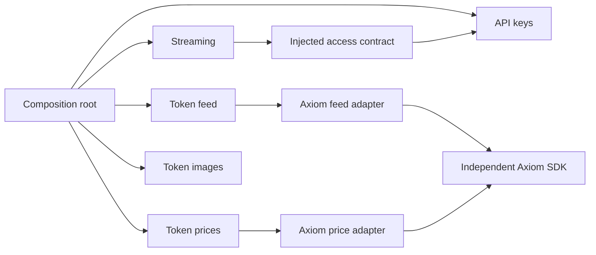

# Модульный рефакторинг Python-бэкенда вертикальными слайсами

Status: `Done`

Created: `2026-09-27`

Updated: `2026-09-27`

Implementation branch: `refactor/backend-modules`

## Goal

Перестроить весь Python-бэкенд в самостоятельные функциональные модули,
содержащие собственные данные, правила, прикладные сценарии, адаптеры и тесты.
Сделать код простым, читаемым и удобным для расширения и будущего выделения
модулей в сервисы. Ориентир структуры — существующий `app/api_keys`;
его архитектурные недостатки копировать не нужно.

Сохранить внешние HTTP/WebSocket-контракты, данные и алгоритмы приложения.
Для API-ключей источником истины является текущая логика `app/api_keys`:
старую параллельную реализацию заменить обращениями к этому модулю.

Выполнять рефакторинг вертикальными слайсами: каждый функциональный слайс
завершает конкретный путь от входных данных через бизнес-правила и адаптеры
до наблюдаемого результата, включая wiring, тесты и документацию. Не переносить
сначала все модели, затем все repositories, затем все endpoints.

Подготовка и сохранение этого ТЗ не означают начало реализации.

## Requirements

### 1. Ветка и границы работы

- Все изменения по выполнению этого ТЗ делать исключительно в специально
  созданной ветке `refactor/backend-modules`. Не выполнять работу в `main`.
- Перед началом каждого рабочего сеанса проверить ветку и пользовательские
  незакоммиченные изменения. Не сбрасывать и не включать чужие изменения.
- Перед фактической реализацией изменить статус на `In progress` и обновить дату.
- Не создавать другие рабочие ветки для слайсов: завершать их последовательно
  в указанной ветке, с отдельными логическими коммитами после проверок.
- Не коммитить, не публиковать ветку и не сливать изменения без соответствующего
  запроса пользователя. Если коммиты пока не разрешены, сохранять логическое
  разделение слайсов в отчёте о выполнении.

Включить весь `src/server/app`, `src/server/third_party_apis`, связанные тесты,
composition root, регистрацию ORM-моделей, настройку Alembic, dev-проверки и
документацию backend. Клиент и расширение изучать только как потребителей
контрактов; их код не изменять.

Оставить на существующих местах `app/main.py`, `app/database.py`,
`app/config.py`. Содержимое разрешено улучшать в рамках текущих обязанностей.
Сохранить entrypoint `app.main:app` и действующие параметры конфигурации.

Не менять рабочие базы, `.env`, fingerprints, секреты, generated output и
применённые миграции. Изменение схемы БД для рефакторинга не требуется.
Зависимости менять только для согласованных dev-проверок; не обновлять
production dependencies попутно.

### 2. Целевая структура и владельцы обязанностей

```text
src/server/
├── app/
│   ├── main.py
│   ├── database.py
│   ├── config.py
│   ├── composition.py
│   ├── api_keys/
│   ├── token_feed/
│   ├── streaming/
│   ├── token_prices/
│   └── token_images/
├── third_party_apis/
│   └── axiom_trade_api/
├── scripts/
└── migrations/
```

| Модуль            | Ответственность                                                       | Исходная область                                                |
| ----------------- | --------------------------------------------------------------------- | --------------------------------------------------------------- |
| `api_keys`        | Выпуск, проверка, хранение ключей и очистка просроченных записей      | Текущий модуль, старые authenticator/helpers/repository/cleaner |
| `token_feed`      | Базовые события, developer/funding history и обогащение               | `services/token_feed`, его schemas                              |
| `streaming`       | `/ws`, авторизация соединения, сессии, watchdog, heartbeat и доставка | `api/ws`, `services/auth`, `services/ws_streaming`, WS envelope |
| `token_prices`    | Получение и нормализация событий цены SOL                             | `services/tokens_prices`, получение цены из price broadcaster   |
| `token_images`    | Проверка запроса и получение изображений                              | Существующий модуль изображений                                 |
| `axiom_trade_api` | Независимый SDK Axiom                                                 | Существующие клиенты, auth, модели, agents, pacing и retry      |

В каждом модуле использовать по необходимости:

- `domain.py` — собственные данные и чистые правила;
- `contracts.py` — интерфейсы внешних зависимостей;
- явно названные прикладные файлы — сценарии работы;
- `schemas.py`, `router.py`, `dependencies.py` — транспортная граница;
- `adapters/` — реализации конкретных внешних систем;
- `tests/unit/`, `tests/integration/` — проверки рисков;
- `__init__.py` — ограниченный публичный интерфейс.

Не создавать пустые файлы ради одинакового дерева. Не вводить универсальные
managers, базовые сервисы, repository framework, event bus или сервисную сеть.

`composition.py` собирает runtime: клиенты, сервисы, очереди и адаптеры.
`main.py` подключает маршруты и запускает/останавливает runtime через lifespan.
`database.py` владеет engines, session factories, `Base` и регистрацией моделей.
`config.py` остаётся конфигурацией приложения.

### 3. Зависимости и публичные интерфейсы

- Доменная и прикладная логика зависит от собственных типов и интерфейсов,
  а не от FastAPI, SQLAlchemy, httpx или конкретного SDK.
- Контракт принадлежит модулю, который потребляет зависимость.
- SDK DTO, ORM-модели и transport DTO преобразуются на границе адаптера;
  не использовать их в бизнес-правилах.
- Межмодульные обращения идут через публичный интерфейс пакета:
  например, `from app import api_keys`, затем `api_keys.…`.
- Внутри модуля разрешены явные относительные импорты. Wildcard imports и
  межмодульные импорты приватных реализаций запрещены.
- Composition root может импортировать реализации адаптеров для wiring.
- `__init__.py` не создаёт клиентов, не регистрирует ORM и не запускает задачи.
- Между функциональными модулями не должно быть циклических зависимостей.
- Не заменять конкретные зависимости универсальными `Any`, dynamic imports
  или service locator.



### 4. API-ключи: единая логика

Сделать текущий сервис `api_keys` единственным источником правил для HTTP,
WebSocket и watchdog. Разделить repository contract и SQLAlchemy implementation.
Передавать pepper hasher через конструктор, сохранив алгоритм хеширования.
Не создавать generator/hasher в default arguments.

Расширить внутренний результат успешной проверки полями `kid` и
`max_active_sessions`, необходимыми streaming. В существующий HTTP-ответ
эти поля не добавлять. Подключение streaming к ключам выполнить через
внедряемый контракт проверки доступа и адаптер публичного сервиса `api_keys`.

Сохранить фактические правила текущего модуля:

- формат `asc_<kid>_<secret>`;
- допустимые значения `max_active_sessions` — 1–4;
- истечение при `now >= expires_at`;
- текущую семантику статуса и `revoked_at`;
- обновление записи при проверке и текущие HTTP-ошибки.

Текущий repository не переносит `revoked_at` в доменную модель. Зафиксировать
это как известную проблему; не исправлять молча вместе с рефакторингом.
Перевод WebSocket на правила `api_keys` — согласованное изменение.
Документировать отличия от старой WebSocket-валидации.

Очистку перенести в `api_keys`: сохранить условия удаления, пачку 200 и
интервал 7200 секунд. Транзакции принадлежат инфраструктурной границе,
отмена фоновой задачи не подавляется. Удалить старые независимые валидаторы
и alias ORM-модели после перевода всех потребителей.

### 5. Token feed

Разделить получение SDK-событий, подготовку базового события, обогащение,
выбор исторических токенов и управление очередью/задачами.

Сохранить:

- немедленную отправку базового события без ожидания HTTP;
- независимое параллельное developer/funding enrichment;
- обновления той же пары без гарантии порядка между историями;
- поля payload, даты, `null`, пустые списки и счётчики;
- историю непосредственного funding wallet и отсутствие funding enrichment
  для BSC;
- существующие различия выбора developer history и funding history;
- исключение текущего токена, дубликатов, слишком новых токенов и
  непроверенных fees в funding history;
- текущие параметры кэша, совместное ожидание выполняющегося запроса,
  приоритеты HTTP и деградацию при upstream-ошибках.

Кэши, очередь и задачи принадлежат runtime-экземплярам, а не классам.
Два runtime должны работать независимо. Проверка адреса на входе funding
adapter не должна создавать зависимость token feed от `token_images`.
Не изменять алгоритм developer history под предлогом унификации с funding.

### 6. Streaming, цены и изображения

Сохранить `/ws`, текущий envelope, `token_feed`, `sol_price`, heartbeat и
ошибки; источники ключа и фактический приоритет, error payload, close codes,
лимит сессий, интервалы heartbeat/watchdog и отсутствие replay.

Не активировать rate limiter, если текущий путь подключения его не вызывает.
Учёт соединений отделить от FastAPI через небольшой интерфейс соединения.
FastAPI-адаптер принимает, отправляет и закрывает конкретный WebSocket.
Сохранить порядок и способ рассылки; не добавлять очереди на клиента или
новые политики backpressure.

`token_prices` преобразует событие Axiom в собственные данные цены;
`streaming` отвечает за доставку. `token_prices` не знает о WS-клиентах.

В `token_images` отделить provider contract от HTTP-реализации. Сохранить
валидацию адреса, bytes/media type, статусы 422/404/502 и Cache-Control.

Известные дефекты, включая гонку проверки лимита сессий и ошибку обработки
недоступной БД в watchdog, документировать отдельно. Не расширять объём
работы исправлениями без согласования.

### 7. Независимый SDK Axiom

`third_party_apis` — место для независимых Python SDK; в будущем здесь могут
появляться другие API. Axiom остаётся пакетом в проекте. Собственная сборка,
публикация и установка SDK в эту задачу не входят.

- Не импортировать `app`, FastAPI и SQLAlchemy.
- Не загружать backend `.env`, не читать backend fingerprints и не настраивать
  root logger. Конфигурация и credentials передаются вызывающей стороной.
- Владеть своими HTTP/WS-ресурсами и обеспечивать их закрытие.
- Экспортировать клиент, входные модели, результаты и исключения через
  публичный интерфейс пакета.
- Импорт пакета не создаёт сетевые сессии и фоновые задачи.
- Сохранить refresh, agents/proxy routing, retry/429, pacing, concurrency,
  priorities, fairness и WebSocket reconnect.
- Прикладные кэши историй и правила token feed оставить в backend.

Ручной probe, импортирующий `app.config`, перенести в `src/server/scripts/`.
Обновить команду запуска. SDK импортируется и тестируется без доступного `app`.

### 8. Lifecycle и удаление старого кода

Создавать runtime-ресурсы при сборке приложения; стартовать задачи в lifespan.
При остановке прекращать приём новых событий, отменять и дожидаться задач,
снимать callbacks и закрывать клиентов. Частично неудачный старт должен
освобождать уже созданные ресурсы.

Удалять старый файл только после перевода всех его потребителей. Временные
wrappers допустимы между слайсами, но не в финальном состоянии. В итоге удалить
опустевшие общие `api`, `core`, `services`, `repositories`, `models`, `schemas`.
Обновить `database.py` и Alembic: таблица ключей регистрируется один раз,
без старых alias packages; схема и применённые миграции не меняются.

### 9. Инструменты и документация

Добавить Ruff format/lint, mypy и pytest async configuration. Версии
dev-инструментов закрепить отдельно от production dependencies.
Ruff проверяет базовые ошибки, imports и async; mypy — собственные функции
и их тела всего backend/SDK. Отсутствующие сторонние stubs можно исключать
адресно. Массовые ignores, `Any` и исключения своих модулей запрещены.

Обновлять соответствующую документацию вместе с каждым слайсом:
[архитектуру](../architecture.md), [разработку](../development.md) и связанные
описания контрактов/данных. Добавить ADR по [шаблону](../adr/template.md)
о функциональных границах, публичных интерфейсах и независимом SDK.
Не выдавать будущую структуру за текущее состояние до реализации.

## Acceptance criteria

### Архитектура и совместимость

- Каждая обязанность имеет одного владельца; нет циклов и обратных зависимостей SDK.
- HTTP, WebSocket и watchdog используют один сервис API-ключей.
- Доменная/прикладная логика не импортирует конкретные transports, ORM и SDK.
- Старые дубли, wrappers, runtime singletons и закомментированные реализации удалены.
- Entry point и расположение трёх корневых файлов сохранены.
- HTTP/WS-контракты сохранены, кроме документированного перехода WS к правилам ключей.
- Существующие ключи и схема БД совместимы без изменения применённых миграций.
- Feed сохраняет staged delivery, правила историй, кэш и деградацию.
- SDK сохраняет алгоритмы нагрузки и восстановления соединения.
- Все слайсы завершены вместе с wiring, проверками и документацией.

### Минимальный набор важных тестов

Существующие полезные тесты сохранить и перенести. Добавлять проверки по
рискам, объединяя родственные случаи параметризацией. Не писать тесты getters
или тесты, повторяющие реализацию. Проверять наблюдаемый результат, а не только
число вызовов mock. Для repository использовать реальную изолированную БД.

| Область    | Необходимые сценарии                                                                                                                  |
| ---------- | ------------------------------------------------------------------------------------------------------------------------------------- |
| Ключи      | Выпуск и запись в БД; valid; malformed/wrong secret/missing; граница expiry; фактическая revoked semantics; границы сессий            |
| HTTP       | Admin access; успешный контракт и основные ошибки                                                                                     |
| WS         | Созданный HTTP ключ допускается в `/ws`; отказ неверному; лимит; освобождение места; общий валидатор watchdog                         |
| Feed       | Base выходит при заблокированном HTTP; независимые updates; сбой одной истории не теряет другую; выбор истории; дедупликация запросов |
| Streaming  | Payload feed/цены/heartbeat; фактическая реакция на ошибку отправки                                                                   |
| Images     | Upstream conversion; invalid address; missing image; upstream failure                                                                 |
| SDK        | Pacing/fairness/concurrency; retry/429; refresh/reconnect; импорт без `app`                                                           |
| Runtime    | Изоляция двух экземпляров; shutdown и частично неудачный startup                                                                      |
| DB/imports | Единственная ORM-модель; прежняя схема; запрещённые направления зависимостей                                                          |

Несколько тестов не гарантируют проверку всего. Каждый существенный риск
должен иметь содержательную проверку; уменьшать число файлов тестов ценой
потери сценариев нельзя. Сеть/время/сбои моделировать детерминированно.

## Implementation notes

### Правила выполнения вертикальных слайсов

Порядок ниже обязателен. Слайс включает вход, собственные типы и правила,
адаптеры, composition wiring, реальный выход, необходимые regression tests и
документацию. Он заканчивается работающим путём, а не набором перенесённых
файлов. Приложение остаётся запускаемым после каждого слайса.

Нельзя оставлять подключение нового кода до общего финального этапа.
Старую реализацию завершённого пути удалить сразу после перевода потребителей;
общие временные bridges удалить, когда завершён последний потребитель.
Слайсы не разрешают дополнительные исправления бизнес-логики.

### Слайс 0. Baseline и проверяемая основа

**Вход:** текущий backend и его потребители. **Выход:** зафиксированная исходная
совместимость и воспроизводимые команды проверок.

1. Убедиться, что активна `refactor/backend-modules`; отметить начало реализации.
2. Проверить актуальные инструкции, routes, client usage и baseline pytest.
3. Зафиксировать HTTP/WS-контракты, правила ключей, pipeline и известные дефекты.
4. Настроить dev-инструменты и минимальные fixtures без production credentials.
5. Добавить необходимые characterisation tests в текущие тестовые области;
   не создавать вторую реализацию функций ради fixtures.

**Готовность:** baseline-ошибки отделены от новых, команды описаны, ограничения
документированы. Это подготовительный слайс; не заменять им функциональные.
Существующие style/type нарушения устранять в затрагиваемых путях последующих
слайсов; не объявлять полный check успешным до устранения остальных нарушений.

### Слайс 1. Выпуск и HTTP-проверка API-ключа

**Путь:** HTTP request → DTO → command/service → repository adapter → БД → response.

Разделить domain/contracts/SQLAlchemy, внедрить pepper и зависимости, оформить
публичный API. Подключить новый путь в действующие HTTP routes. Перевести
регистрацию ORM в database/Alembic без schema changes. Проверить создание,
проверку, ошибки, expiry/session boundaries и чтение прежних записей.

**Готовность:** HTTP полностью работает через новую структуру; его старые
дубли удалены. Старую WS-валидацию пока оставить только до следующего слайса.

### Слайс 2. Доступ к WS и завершение жизненного цикла ключа

**Путь:** `/ws` credentials → injected access check → `api_keys` → session
registration → watchdog/disconnect; БД → expiry cleanup → удалённые записи.

Перенести endpoint/auth/session/watchdog в `streaming`; внедрить контракт
соединения и единый валидатор. Расширить внутренний результат ключей, не меняя
HTTP response. Перенести cleaner в `api_keys`, подключить lifecycle. Проверить
сквозной HTTP-create → WS-connect, отказ, лимит, disconnect и повторную проверку.

**Готовность:** старые authenticator/helpers/key repository/cleaner и ORM aliases
не имеют потребителей и удалены; согласованные отличия WS документированы.
Рассылка ещё может пользоваться временным публичным bridge к streaming.

### Слайс 3. Независимый Axiom SDK и базовый feed

**Путь:** injected agents → SDK WebSocket → backend adapter → собственное событие
→ базовый feed → runtime queue → действующий WS payload.

Оформить публичный API SDK и убрать зависимости от backend, перенести probe.
Перевести подключение SDK в composition. Выделить `token_feed`, domain event,
base preparation и очередь экземпляра. Подключить базовое событие к работающей
доставке. Обогащение временно подключить через локальный adapter/bridge с явным
преобразованием данных, без SDK DTO в новой прикладной логике.

**Готовность:** базовое событие выходит без HTTP-ожидания; SDK импортируется
без `app`; прежние тесты pacing/routing/reconnect проходят. Старые пути SDK
в backend больше не используются. Сеть при обычном импорте не запускается.

### Слайс 4. История разработчика

**Путь:** собственное событие → history provider → SDK HTTP adapter → developer
rules → update той же пары → queue → WS client.

Перенести developer enrichment и его mapping, кэш и request priorities в
экземпляры token feed. Сохранить фактический выбор последних монет, fees и
fallback. Подключить update к действующему pipeline. Проверить delayed HTTP,
ошибку provider, payload и shared-request cache.

**Готовность:** developer path полностью независим от старого preparer;
его часть старой реализации удалена; funding path продолжает работать.

### Слайс 5. История funding wallet

**Путь:** текущая Solana pair → provider → immediate funder → history/fees
→ чистый выбор кандидатов → funding update → queue → WS client.

Перенести funding orchestration и правила с собственными типами, сохраняя
кэш, проверку адреса, исключения/дубликаты/time cutoff/fees и деградацию.
Убрать временные feed bridges. Проверить оба порядка developer/funding updates,
сбой одного enrichment, BSC skip и отмену задач.

**Готовность:** весь token feed работает через новый модуль; старые
`services/token_feed` и его общие schemas удалены; очередь и кэш изолированы.

### Слайс 6. Цена SOL, heartbeat и общая доставка

**Путь:** SDK price event → price adapter → собственные данные → streaming
envelope → clients; timer → heartbeat → clients.

Выделить `token_prices`, внедрить источники событий в streaming, завершить
перенос broadcasters. Сохранить сериализацию, интервалы и реакцию на send error.
Убрать singleton manager и starter, удалить временный delivery bridge.
Проверить payload цены/feed/heartbeat и регистрацию/снятие callbacks.

**Готовность:** все типы рассылки идут через новый streaming; прежние
`services/tokens_prices` и `services/ws_streaming` больше не нужны и удалены.

### Слайс 7. Изображение токена

**Путь:** HTTP address → validation → provider contract → HTTP adapter
→ image bytes/media type → Response или прежняя ошибка.

Разделить provider contract и реализацию, подключить через composition/dependency.
Сохранить upstream limits, validation, media type, headers и ошибки. Перенести
существующие полезные тесты, добавить недостающие boundary scenarios.

**Готовность:** путь изображений завершён и не создаёт зависимости других
бизнес-модулей от своего router/provider implementation.

### Слайс 8. Полный запуск/остановка и итоговая приёмка

**Путь:** `app.main:app` → composition → startup всех модулей → обработка
запросов/событий → shutdown и освобождение ресурсов.

Завершить runtime lifecycle, проверить частично неудачный startup и два
независимых runtime. Удалить последние bridges, опустевшие старые пакеты и
закомментированный код. Провести проверку forbidden imports и циклов.
Закончить style/type исправления актуального backend/SDK, документацию и ADR.
Запустить полный набор проверок. Не откладывать рабочее wiring до этого слайса:
здесь проверяется совместная работа уже подключённых путей.

**Готовность:** выполнены все общие критерии, нет скрытой старой реализации;
в отчёте указаны результаты и ограничения. Только после этого — `Done`.

### Проверки

Для каждого слайса проверять formatter/lint/types и тесты затронутых областей,
`compileall` и import/startup smoke без live Axiom. Финально из `src/server`:

```powershell
python -m ruff format --check app third_party_apis scripts migrations
python -m ruff check app third_party_apis scripts migrations
python -m mypy app third_party_apis scripts migrations
python -m compileall app third_party_apis scripts migrations
python -m pytest -q
```

Дополнительно проверить routes/lifespan с подменёнными внешними адаптерами,
Alembic и неизменность схемы на временной БД, независимый импорт SDK.
Собрать серверный Docker image штатным Dockerfile, если Docker доступен.
`compileall` не считать полноценной сборкой. Live probe требует credentials
и не является обязательным автоматическим тестом.

Непроведённые проверки не считать успешными. В итоговом отчёте перечислить
команды, результаты, согласованные отличия поведения и известные дефекты.
Не объединять baseline failures с regression без объяснения.

## Result

Реализованы слайсы 0–8 в ветке `refactor/backend-modules`. Backend разделён на
api_keys, token_feed, streaming, token_prices и token_images; Axiom SDK независим
от app. Runtime собирает адаптеры и управляет задачами/callbacks/resources.
Старые общие пакеты, валидаторы, singleton и ORM aliases удалены. Схема и
применённые миграции сохранены; клиент и расширение не изменялись.

Восстановлены INFO-логи токенов со смайликами; HTTP diagnostics имеют уровень
DEBUG. Закреплены dev-инструменты. Итоговые проверки: Ruff format/lint, mypy для 105
файлов и compileall успешны; pytest — 91 passed, включая Alembic/schema,
HTTP → WS, staged enrichment, cache/lifecycle и независимый SDK import.
Docker build недоступен: Docker daemon не запущен/pipe отсутствует. Live probe
не запускался, поскольку требует credentials; автоматические тесты без сети.

Согласованные отличия WS, известные дефекты, разделение слайсов и команды
зафиксированы в [отчёте](../backend-refactoring.md), архитектурное решение —
в [ADR 0003](../adr/0003-backend-modules.md). Слияние в main и публикация не выполнялись.
