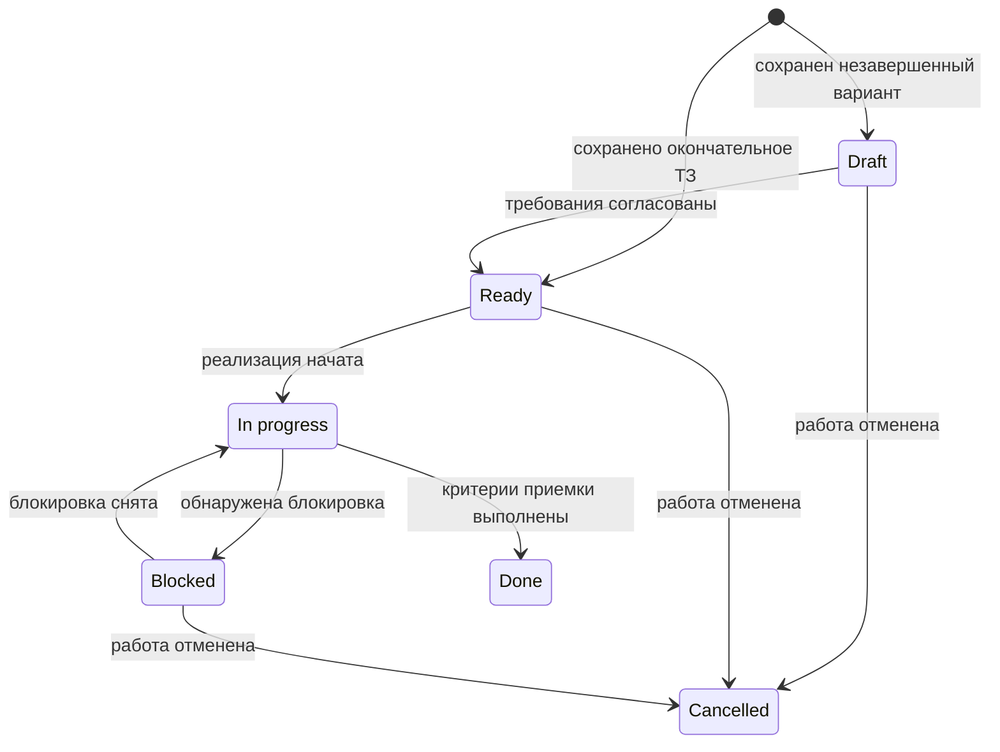

# Технические задания

В этом каталоге хранятся подготовленные по явному запросу пользователя
технические задания на новые функции и другие будущие изменения. ТЗ фиксирует
цель, границы и проверяемый результат, но не заменяет документацию текущего
состояния или ADR с обоснованием архитектурного решения.

## Когда создавать ТЗ

Новый файл создается, только если пользователь прямо просит написать, составить
или оформить техническое задание по его требованиям. Запрос на реализацию,
исправление, исследование, ревью или объяснение без просьбы подготовить ТЗ не
является основанием для создания файла в этом каталоге.

Сохраняется окончательная редакция ТЗ. Черновики из обсуждения не добавляются в
репозиторий. Подготовка ТЗ сама по себе не означает начало реализации.

## Именование

Файлы именуются `NNN-short-title.md`, где `NNN` — следующий свободный
трехзначный номер, а `short-title` — краткое имя в нижнем регистре с дефисами.
Перед созданием файла нужно найти наибольший существующий номер и увеличить его
на один. Номера удаленных или отмененных ТЗ повторно не используются.

Примеры:

```text
docs/tasks/
├── README.md
├── template.md
├── 001-admin-auth.md
├── 002-refresh-token-rotation.md
└── 003-admin-permissions.md
```

## Статусы

Поле `Status` в начале ТЗ содержит одно из следующих значений:

| Статус        | Значение                                              |
| ------------- | ----------------------------------------------------- |
| `Draft`       | Требования еще уточняются; ТЗ не готово к реализации  |
| `Ready`       | Окончательное ТЗ готово к реализации                  |
| `In progress` | Реализация начата                                     |
| `Blocked`     | Продолжение временно невозможно; причина указана в ТЗ |
| `Done`        | Критерии приемки выполнены и результат зафиксирован   |
| `Cancelled`   | От реализации отказались; причина указана в ТЗ        |

Новая окончательная редакция получает статус `Ready`. `Draft` используется,
только если пользователь явно просит сохранить незавершенное ТЗ. Статус
меняется при фактическом переходе работы в новое состояние, а поле `Updated` —
на дату изменения. `Done` выставляется только после реализации и выполнения
применимых проверок.

Обычный маршрут выглядит так:



## Содержание и обновление

ТЗ создается по [шаблону](template.md). В нем должны быть:

- цель и границы изменения;
- однозначные функциональные и нефункциональные требования;
- проверяемые критерии приемки;
- существенные ограничения и замечания по реализации без преждевременной
  детализации;
- результат реализации или явная отметка, что она еще не начата.

При любом изменении состояния исполнитель обновляет `Status` и `Updated`. При
завершении реализации также заполняется раздел `Result`, а при `Blocked` или
`Cancelled` в `Implementation notes` указывается причина. Если в ходе реализации
принято значимое долгоживущее архитектурное решение, оно дополнительно
оформляется отдельным ADR.
